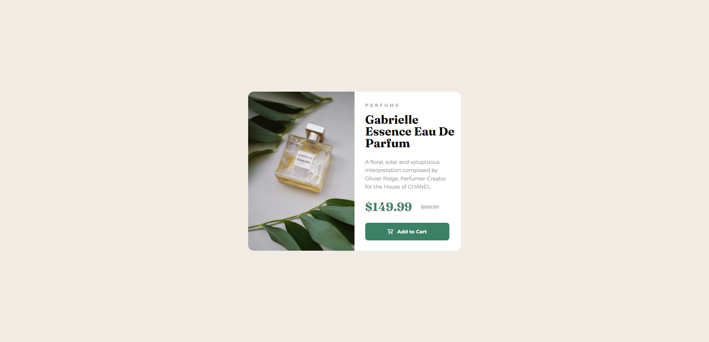

# Frontend Mentor - Product preview card component solution

This is a solution to the [Product preview card component challenge on Frontend Mentor](https://www.frontendmentor.io/challenges/product-preview-card-component-GO7UmttRfa). Frontend Mentor challenges help you improve your coding skills by building realistic projects. 

## Table of contents

- [Overview](#overview)
  - [The challenge](#the-challenge)
  - [Screenshot](#screenshot)
  - [Links](#links)
  - [Built with](#built-with)
  - [What I learned](#what-i-learned)
  - [Continued development](#continued-development)
  - [Useful resources](#useful-resources)
- [Author](#author)

## Overview

### The challenge

Users should be able to:

- View the optimal layout depending on their device's screen size
- See hover and focus states for interactive elements

### Screenshot



### Links

- Solution URL: [solution URL](https://github.com/irfan-hue/Responsive-Product-Preview-Card-Component)
- Live Site URL: [live site](https://irfan-hue.github.io/Responsive-Product-Preview-Card-Component)

### Built with

- Semantic HTML5 markup
- CSS custom properties
- Flexbox
- Mobile-first workflow

### What I learned

To see how you can add media queries and create responsive design, see below:

```css
@media only screen and (min-width: 1440px) {
    .card {
        width: 40vw;
    }

    .card .desktop-image {
        display: block;
        width: 50%;
        height: auto;
    }

    .card .mobile-image {
        display: none;
    }

    .content {
        width: 50%;
    }
}

@media only screen and (min-width: 1500px) {
    .card {
        width: 38%;
        display: flex;
        background-color: var(--white);
        overflow: hidden;
        border-radius: 15px;
    }

    .card .desktop-image {
        display: block;
        width: 50%;
        height: auto;
    }

    .card .mobile-image {
        display: none;
    }

    .content {
        width: 50%;
    }
}

@media only screen and (min-width: 1600px) {
    .card {
        width: 36%;
        display: flex;
        background-color: var(--white);
        overflow: hidden;
        border-radius: 15px;
    }

    .card .desktop-image {
        display: block;
        width: 50%;
        height: auto;
    }

    .card .mobile-image {
        display: none;
    }

    .content {
        width: 50%;
    }
}

@media only screen and (min-width: 1700px) {
    .card {
        width: 34%;
        display: flex;
        background-color: var(--white);
        overflow: hidden;
        border-radius: 15px;
    }

    .card .desktop-image {
        display: block;
        width: 50%;
        height: auto;
    }

    .card .mobile-image {
        display: none;
    }

    .content {
        width: 50%;
    }
}

@media only screen and (min-width: 1800px) {
    .card {
        width: 32%;
        display: flex;
        background-color: var(--white);
        overflow: hidden;
        border-radius: 15px;
    }

    .card .desktop-image {
        display: block;
        width: 50%;
        height: auto;
    }

    .card .mobile-image {
        display: none;
    }

    .content {
        width: 50%;
    }
}

@media only screen and (min-width: 1880px) {
    .card {
        width: 30%;
        display: flex;
        background-color: var(--white);
        overflow: hidden;
        border-radius: 15px;
    }

    .card .desktop-image {
        display: block;
        width: 50%;
        height: auto;
    }

    .card .mobile-image {
        display: none;
    }

    .content {
        width: 50%;
    }
}
```

If you want more help with writing markdown, we'd recommend checking out [w3schools](https://www.w3schools.com/) to learn more.

### Continued development

-My focus is still on responsive designs and creativity.

### Useful resources

- [W3Schools](https://www.w3schools.com) - This helped me for media queries and making the design responsive. I really liked this pattern and will use it going forward.

## Author

- Frontend Mentor - [@irfan-hue](https://www.frontendmentor.io/profile/irfan-hue)
- LinkedIn - [@raja-irfan-ahmed-203682217](https://www.linkedin.com/in/raja-irfan-ahmed-203682217/)
